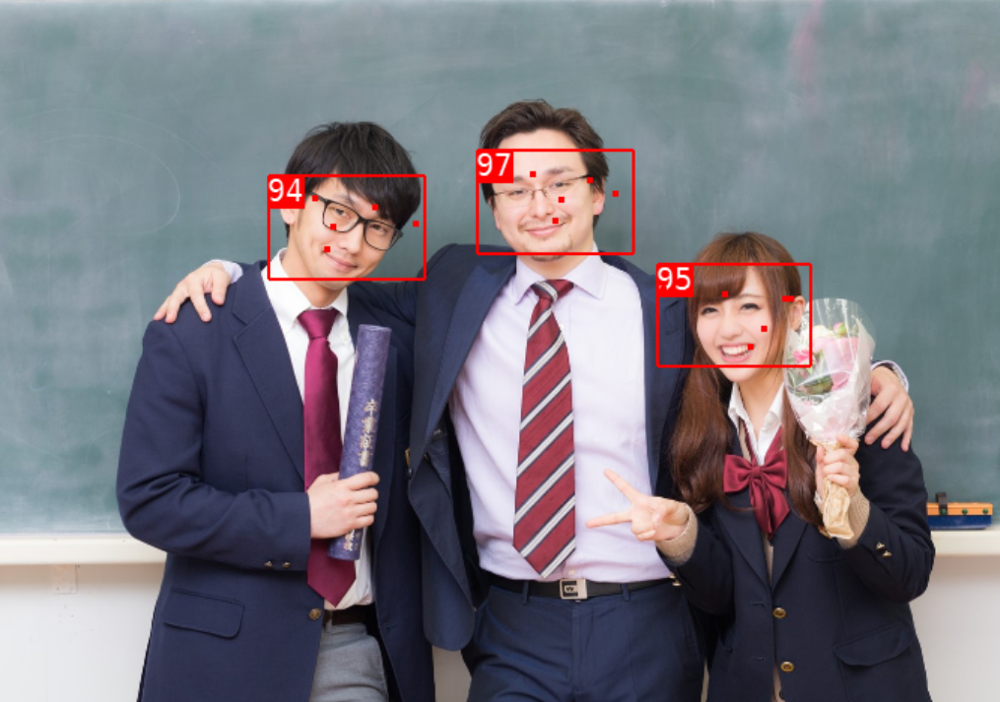
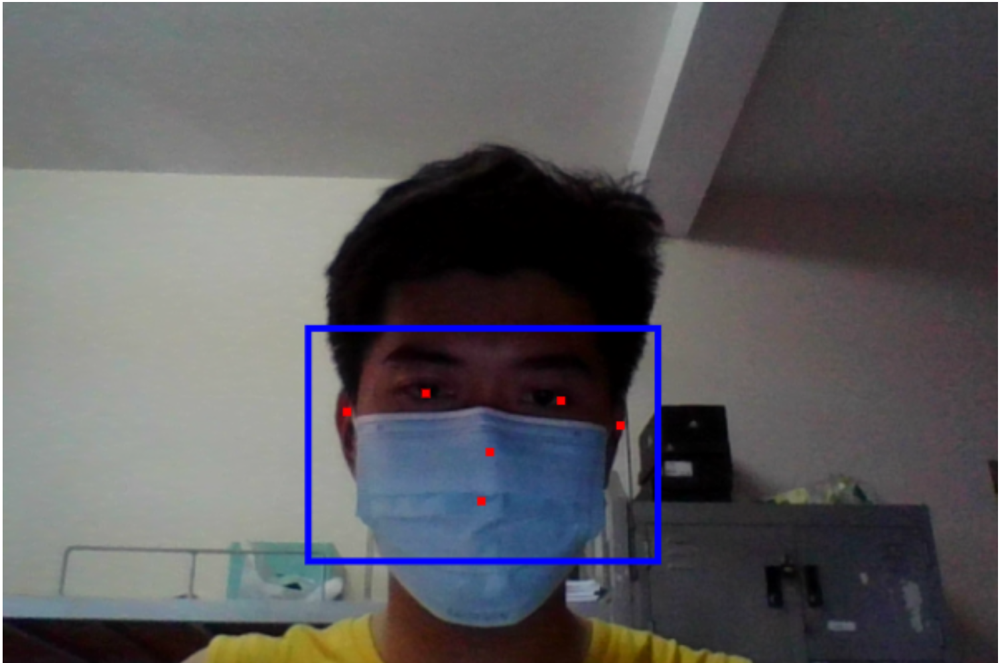
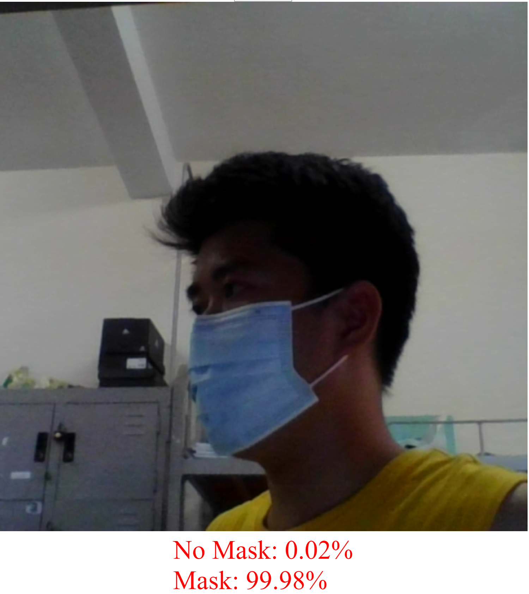
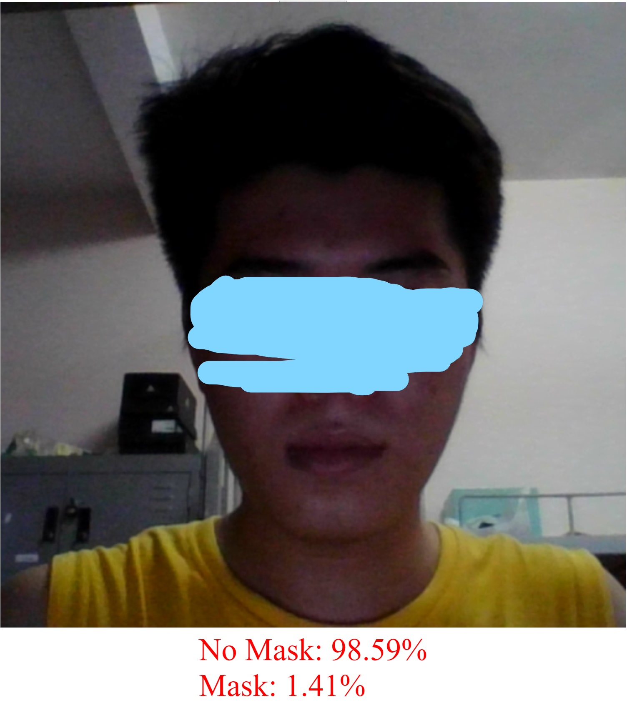
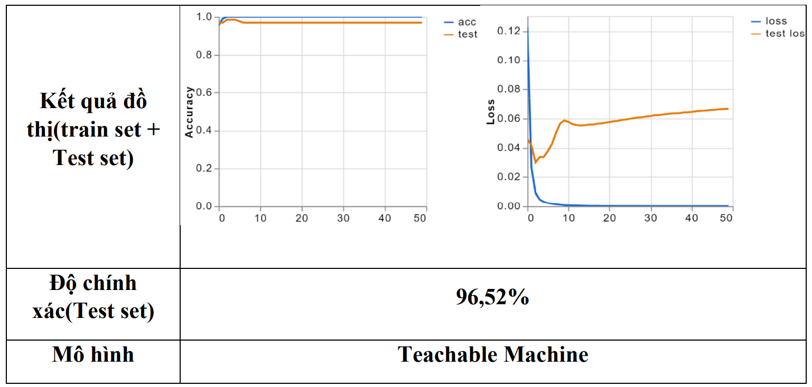
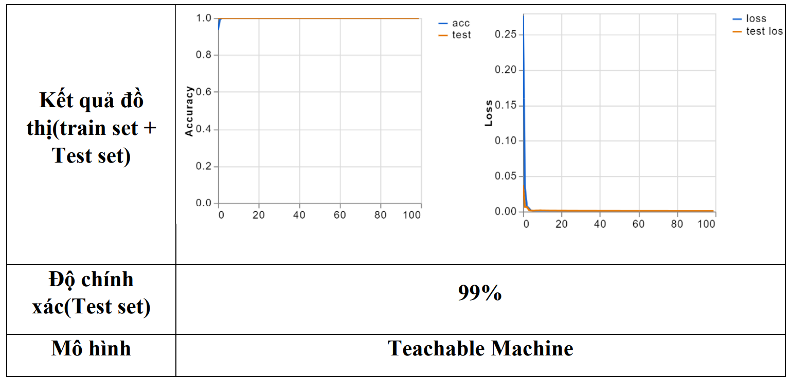

# Face Recognition Mask Detection

**_[Language VietNamese]_**

Ứng dụng Web nhận diện gương mặt có đeo khẩu trang được xây dựng trên Raspberry Pi 4B và Camera Pi, được chạy trên Web browser có thể triển khai bất kỳ thiết bị nào có thể cài đặt được Web browser. 

 

## 🔑Features
Được chạy trên Raspberry Pi 4B nhỏ gọn, điện năng tiêu thụ thấp. Ngoài ra thì có thể chạy trên mọi nền tảng như Linux, MacOS, Window. Triển khai dễ dàng khả năng nhận diện gương mặt tốt.

**Tính năng nhận diện gương mặt:**
  * Nhận diện gương mặt ở mọi góc độ.
  * Có các điểm chấm nhỏ dùng để chỉ vị trí: mắt, mũi, miệng, tai.
  * Khoanh vùng gương mặt.
  
  
  
**Tính năng nhận diện gương mặt đeo khẩu trang:**
  * Có thể nhận diện gương mặt đeo khẩu trang.
  * Phân biệt gương mặt không đeo khẩu trang.
  * Hiển thị độ chính xác giữa 2 lớp No Mash và Mash.
  
   
## 🔧Installation setup
Architecture diagram nhận diện gương mặt đeo khẩu trang.

### **Huấn luyện mô hình**

  * Huấn luyện mô hình lần 1
  
   
    *Nhận xét* : Bộ kiểm tra thử, lại cho đồ thị dự đoán về độ lỗi (Loss) cao và không bám sát theo mô hình và cần lọc hình ảnh sai lệch và huấn luyện lại mô hình.
  
  * Điều chỉnh dữ liệu(dataset) và huấn luyện lại mô hình
  
  
    *Nhận xét* : Sau khi có sự điều chỉnh, cải thiện dataset và train lại model thì độ chính xác được tăng lên rất cao và dự đoán độ lỗi (Loss) được giảm xuống mức thấp nhất.

## 📘Main libraries used
Các API và train model: [Blazeface](https://github.com/tensorflow/tfjs-models/tree/master/blazeface) ,[Teachable Machine](https://teachablemachine.withgoogle.com/)

## 🌏Other Social Media

📌[GitHub](https://github.com/HuygaoBE)

📌[FaceBook](https://www.facebook.com/profile.php?id=100007416721622)

Vui lòng đánh giá sao cho các dự án của tôi trên GitHub, để tôi có thêm động lực để tạo ra nhiều dự án hữu ích cho cộng đồng.
